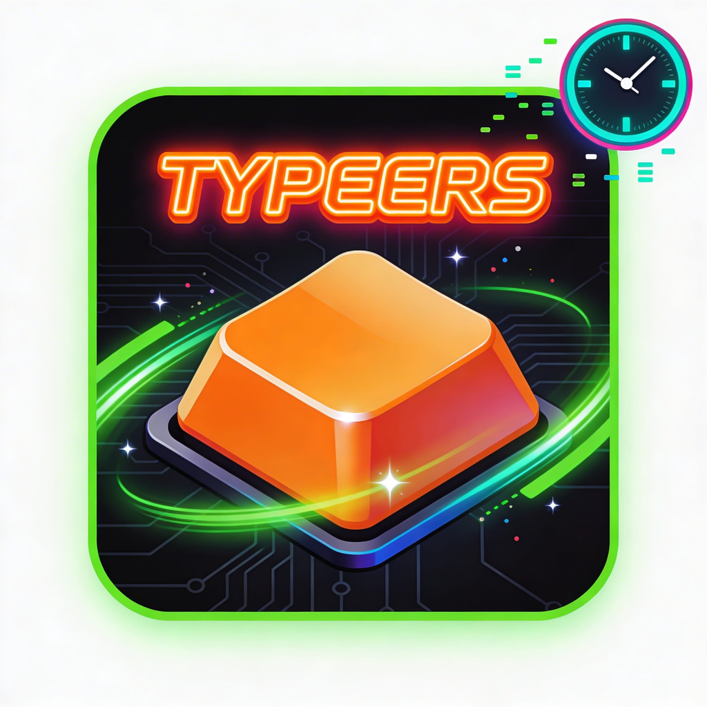

# ⌨️ Typeers

A fast-paced typing game built natively on Reddit using Devvit. Type fast, beat the clock, and climb the leaderboard!



## 🎮 What is Typeers?

Typeers is a retro arcade-style typing game where players race against the clock to type words correctly. What makes it unique is that the content comes directly from Reddit — words are pulled from subreddit posts, comments, and community-created levels.

### Features

- **Multiple Game Modes**
  - Daily Challenge with consistent word sets
  - Category-based levels (Reddit, Tech, Animals, Gaming, Space)
  - Community Words pulled from your subreddit's top posts
  - Weekly Tournaments with competitive rankings

- **User-Generated Content**
  - Create custom levels from any post or comment
  - Browse and play community-created levels
  - Rate and remix levels from other players
  - Creator leaderboards and achievement badges

- **Progression System**
  - Real-time daily leaderboards
  - Persistent stats tracking (streaks, WPM, accuracy, all-time bests)
  - Combo multipliers and time bonuses
  - Personal records and achievements

- **Retro Aesthetic**
  - Classic arcade visuals with particle effects
  - Procedurally generated sound effects
  - Smooth 60fps gameplay powered by Phaser 3

## 🚀 Installation

### For Moderators

1. Visit the [Devvit Apps Directory](https://developers.reddit.com/apps)
2. Search for "Typeers"
3. Click "Install" and select your subreddit
4. The app will create an initial game post automatically

### Manual Installation

If you're a moderator and want to install directly:

```bash
devvit install typeers <your-subreddit>
```

## 📖 How to Use

### Playing the Game

1. Click on any Typeers post in your subreddit
2. Click "PLAY NOW" to start
3. Type the words that appear on screen as fast as you can
4. Build combos for bonus points and extra time
5. Complete all words before time runs out!

### Creating Custom Levels

**From a Comment:**
1. Find any comment with interesting words
2. Click the three dots menu (⋯)
3. Select "🎮 Create Typeers Level"
4. A new game post will be created with words from that comment

**From a Post:**
1. Open any post in your subreddit
2. Click the three dots menu (⋯)
3. Select "⌨️ Create Typeers Level from Post"
4. Words will be extracted from the post title and body

**Custom Level (In-Game):**
- Use the in-game level creator to build your own word lists
- Share your creations with the community
- Browse and play levels from other creators

### Starting a Weekly Tournament

Moderators can start weekly tournaments:

1. Go to your subreddit
2. Click "Mod Tools" → "Community Apps"
3. Find Typeers and click "🏆 Start Weekly Tournament"
4. A pinned tournament post will be created automatically

## 🛠️ Tech Stack

- **[Devvit](https://developers.reddit.com/)** - Reddit's developer platform
- **[Phaser 3](https://phaser.io/)** - Game engine for rendering and physics
- **[React](https://react.dev/)** - UI components
- **[TypeScript](https://www.typescriptlang.org/)** - Type safety
- **[Hono](https://hono.dev/)** - Backend routing
- **[tRPC](https://trpc.io/)** - Type-safe API calls
- **[Redis](https://redis.io/)** - Leaderboards and persistent storage
- **[Vite](https://vite.dev/)** - Build tooling

## 🎯 Game Mechanics

- **Starting Time:** 10 seconds
- **Time per Word:** +3 seconds (scales with word length)
- **Combo System:** Chain correct words for multipliers (2x, 3x, 4x, 5x max)
- **Time Bonus:** Extra points for completing words quickly
- **Accuracy:** Mistakes break your combo and cost time

## 🏆 Leaderboards

- **Daily Leaderboard:** Resets every day at midnight UTC
- **Weekly Tournament:** Runs Monday to Sunday, best score counts
- **Creator Leaderboard:** Top level creators by plays and ratings
- **Personal Stats:** Track your progress over time

## 🔧 Development

### Prerequisites

- Node.js 22+
- Reddit account connected to [Reddit Developers](https://developers.reddit.com/)

### Setup

```bash
# Clone the repository
git clone <your-repo-url>
cd typeers

# Install dependencies
npm install

# Login to Reddit
npm run login

# Start development server
npm run dev
```

### Commands

- `npm run dev` - Start playtest server
- `npm run build` - Build client and server
- `npm run deploy` - Upload and publish new version
- `npm run test` - Run test suite
- `npm run lint` - Lint code
- `npm run type-check` - TypeScript validation

## 📝 Publishing Updates

1. Make your changes and test locally with `npm run dev`
2. Build the project: `npm run build`
3. Upload the new version: `npm run deploy`
4. The app will be submitted for Reddit review
5. Once approved, it will be available to all installations

## 🤝 Contributing

Contributions are welcome! Please feel free to submit issues or pull requests.

## 📄 License

BSD-3-Clause

## 🔗 Links

- [Devvit Documentation](https://developers.reddit.com/docs)
- [Devvit Community](https://www.reddit.com/r/Devvit)
- [Report Issues](https://github.com/your-repo/issues)

## 💡 Tips for Players

- Focus on accuracy over speed at first
- Build combos for maximum points
- Watch the timer — time management is key
- Practice with different categories to improve
- Create your own levels to challenge friends

## 🎨 Customization

Moderators can customize the game experience:
- Create themed word packs from subreddit content
- Host weekly tournaments with custom rules
- Feature top players in community posts
- Build level collections for special events

---

**Made with ❤️ for Reddit communities**
